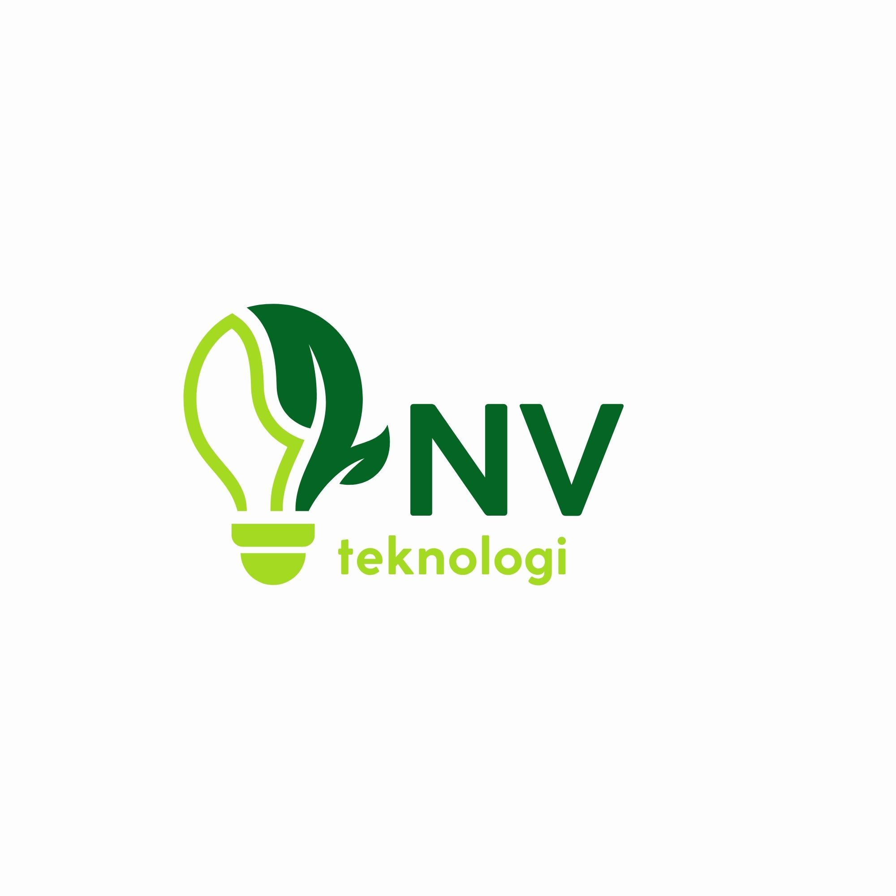
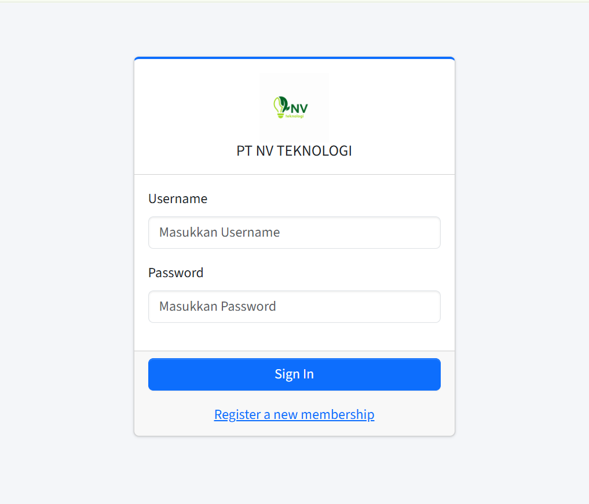
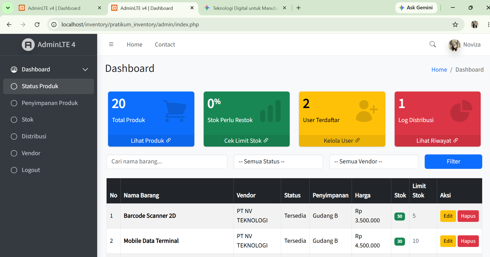
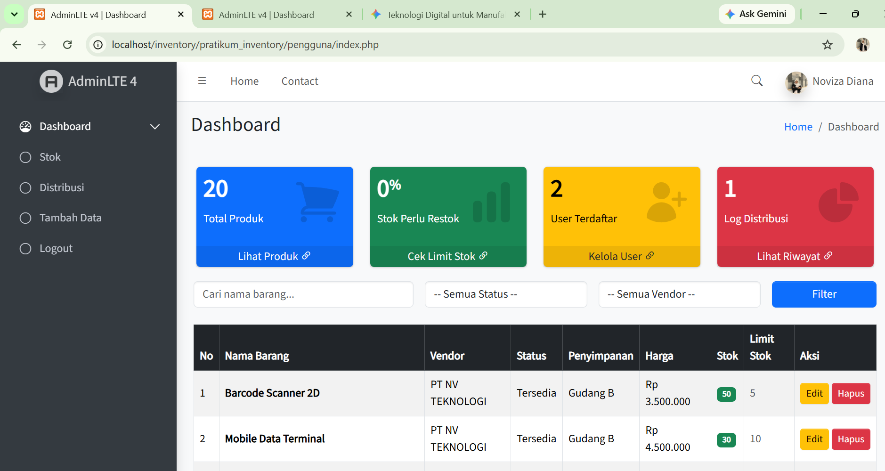

# praktikum_sistem-Informasi

# PT NV TEKNOLOGI

# PROFIL SINGKAT 

PT NV Teknologi Indonesia adalah perusahaan penyedia solusi teknologi berbasis Industri 4.0 yang berfokus pada transformasi digital sektor industri, manufaktur, dan sistem rantai pasok (supply chain). Kami mengintegrasikan teknologi Internet of Things (IoT), Artificial Intelligence (AI), dan otomatisasi data untuk membantu perusahaan meningkatkan efisiensi operasi, meminimalkan downtime, dan mencapai produktivitas maksimal.
Berawal dari visi untuk membawa industri lokal bersaing di kancah global, PT NV Teknologi hadir sebagai mitra strategis dalam merancang ekosistem pabrik pintar (Smart Factory) yang adaptif, aman, dan berkelanjutan.

# VISI

“ Menjadi pionir dan penggerak utama transformasi Industri 4.0 di Asia Tenggara melalui inovasi teknologi yang integratif dan berkelanjutan ”

# MISI

1.	Menyediakan solusi otomatisasi dan pemantauan berbasis IoT yang presisi untuk efisiensi biaya operasional mitra bisnis.
2.	Mengembangkan sistem kecerdasan buatan (AI) untuk optimasi proses produksi dan perawatan mesin prediktif (predictive maintenance).
3.	Memberikan layanan konsultasi dan implementasi teknologi yang adaptif sesuai dengan skala kebutuhan industri.

# LOGO PERUSAHAAN

# LOGIN

# REGISTER

# PROFIL

# TAMPILAN ADMIN

# TAMPILAN USER

# LINK YOUTUBE
